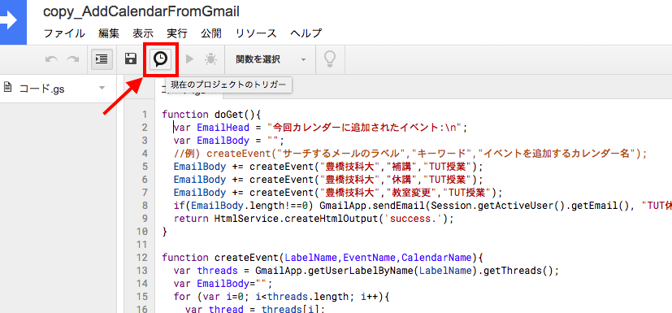

# tutAddCalendarFromGmail
TUTの補講・休講・教室変更情報をGmailからGoogleCalendarに追加するGoogleAppsScriptです。

## 使い方
1. 教務から来るメールをGmailへ転送し、ラベルを"豊橋技科大"とする。
2. "tutAddCalendarFromGmail.gs"をGoogleDriveに保存する。  
3. 保存した"tutAddCalendarFromGmail.gs"を開いて、プロジェクトのトリガー（プログラムを実行する時間）を決める。詳しくは図を参照
<figure>
<legend>GoogleAppsScript編集画面</legend>

</figure>
4. プログラムが実行されると、Googleカレンダーに新しく"TUT授業"というカレンダーが作成され、そこに補講・休講・教室変更情報が追加されます。  

## 原理
教務から送られてくるメールはだいたい以下のフォーマットになっています。  
>■開講学部：工学部  
■時間割番号：B136*****  
■時間割名：ほげほげ  
■教室変更日：2017/06/08のみ  
■時限：2限  
■時間：10:30～12:00  
■変更前教室：Ａ２棟講義室 A2-301  
■変更後教室：Ａ１棟講義室 A1-201  
■学生へのメッセージ  

このメールをパースして、カレンダーのイベントに追加します。（カレンダーが無い場合は新しく作成します。）  
カレンダーに追加したイベントはメールで通知されます。

### 改善したい点
- 補講・休講・教室変更の取り消しメールに対応していない。
